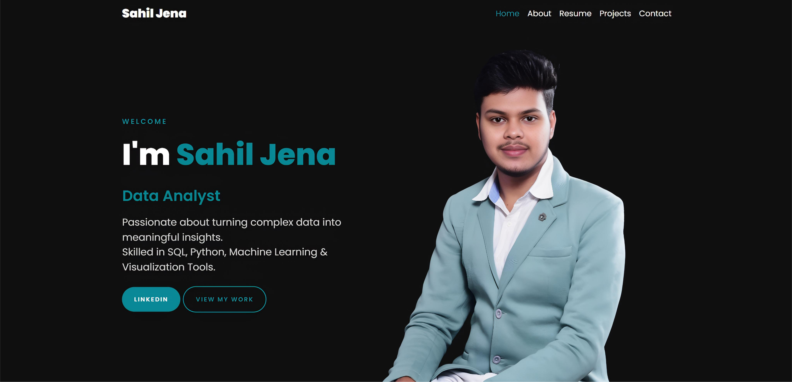

# 🚀 Sahil Swaraj Jena – Portfolio Website

[](https://sahil-s2.github.io/)

> A modern, mobile-responsive portfolio website built with HTML, CSS, JavaScript, and Bootstrap — featuring Power BI dashboards, data projects, and more.



## 🔧 Built With


---

## 💼 About Me

Hi, I'm **Sahil Swaraj Jena**, a passionate Data Analyst and aspiring Machine Learning enthusiast.  
This portfolio highlights my skills, projects, certifications, dashboards, and a journey through data.

## 🔥 Features

- ✅ Responsive and Mobile-Friendly Design
- 📊 Interactive **Power BI Dashboards**
- 🎓 Verified **Certificates**
- 💡 Real-world **Projects** with GitHub links
- 📄 **Downloadable Resume**
- 🧠 Typing animation with key skillsets
- ✨ Smooth AOS scroll animations & glow effects

## 🛠️ Technologies Used

- HTML5 / CSS3 / JavaScript
- Bootstrap 4 / AOS Animation Library
- Font Awesome / Icons / Google Fonts
- GLightbox for Image Popups
- Hosted via **GitHub Pages**

## 📂 Folder Structure

```bash
.
├── index.html
├── css/
│   └── styles.css
├── js/
│   └── main.js
├── images/
│   └── icons, project screenshots, resume icon, etc.
├── files/
│   └── resume.pdf
└── README.md
````

## 📬 Contact Me

* 📧 Email: [sahilswarajjena456@gmail.com](mailto:sahilswarajjena456@gmail.com)
* 📍 Location: Hyderabad, India
* 🌐 [LinkedIn](https://www.linkedin.com/in/sahil-jena-067b1b301)
* 🧠 [GitHub](https://github.com/Sahil-S2)

## 📌 How to Use This Repo

```bash
# 1. Clone the repository
git clone https://github.com/Sahil-S2/sahil-s2.github.io

# 2. Open the folder
cd sahil-s2.github.io

# 3. Launch index.html in browser or deploy to GitHub Pages
```

## 🌟 Credits

This portfolio was customized using modern web technologies and deployed using GitHub Pages.

---

> “Data is a precious thing and will last longer than the systems themselves.”
> — *Tim Berners-Lee*

```
